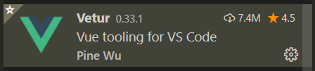

# vue基本概念


- 为什么要学习vue   （vue/react/angular）
  - 公司对vue有要求 [BOSS直聘](<https://www.zhipin.com/>)
  - 开发更加的效率和简洁，并且容易维护。

## vue介绍

- [vue 中文网](https://cn.vuejs.org/)  尤雨溪 
- [Vue.js 是什么](https://cn.vuejs.org/v2/guide/index.html#Vue-js-%E6%98%AF%E4%BB%80%E4%B9%88)
- Vue (读音 /vjuː/，类似于 **view**) 是一套用于构建用户界面的**渐进式javascript框架**。  

### 渐进式的概念

渐进式：逐渐增强，可以在项目中使用vue的一部分功能，也可以使用vue的全家桶来管理整个项目。

angular: 全家桶 


### 框架的概念

- [我们所说的前端框架与库的区别？](https://zhuanlan.zhihu.com/p/26078359?group_id=830801800406917120)

**Library**

- 代表：moment  axios
- 库，本质上是一些函数的集合。每次调用函数，实现一个特定的功能   工具箱

- 使用库的时候，把库当成工具使用，需要自己控制代码的执行逻辑。

**Framework**

- 代表：vue、angular、react、bootstrap
- 框架，是一套完整的解决方案

- 使用框架的时候，框架实现了大部分的功能，我们只需要按照框架的规则写代码

**库和框架的区别**

- 使用库的时候，很自由，只要调用库提供的各种各样的方法就行，也可以不用其他的一些方法
- 使用框架的时候，需要按照框架的规则写代码，限制会非常多，但同时框架的功能也很强大，可以极大的提升开发的效率。


### vue是 MVVM 的框架

- MVVM思想：一种软件架构模式，决定了写代码的方式。
  - M：model数据模型(ajax获取到的数据)	
  - V：view视图（页面）
  - VM：ViewModel 视图模型

- MVVM通过`数据双向绑定`让数据自动地双向同步  **不在需要操作DOM**
  - V（修改视图） -> M（数据自动同步）
  - M（修改数据） -> V（视图自动同步）


**1. 在vue中，不推荐直接手动操作DOM！！！**     

**2. 在vue中，通过数据驱动视图，不要在想着怎么操作DOM，而是想着如何操作数据！！**


## 开发vue的方式

开发vue有两种方式   

- 传统开发模式：基于html/css/js文件开发vue 
- 工程化开发方式：在webpack环境中开发vue，这是最推荐的方式。
- 现代化的项目也都是在webpack环境下进行开发的。


# vue-cli的使用

> `vue-cli`也叫vue脚手架,`vue-cli`是vue官方提供的一个全局命令工具，这个命令可以帮助我们快速的创建一个vue项目的基础架子。

- 开箱即用
- 零配置
- webpack、babel

## 基本使用

- 全局安装命令 

```bash
npm install -g @vue/cli
# OR
yarn global add @vue/cli
```

- 查看版本`vue`

```js
vue --version
```

- 初始化一个vue项目

```js
vue create 项目名(不能用中文)
```

- 启动项目

```
yarn serve
yarn build
```


## 如何覆盖webpack配置

> 注意：我们在项目无法找到webpack.config.js文件，因为vue把它隐藏。

如果需要覆盖webpack的配置，可以修改vue.config.js文件，覆盖webpack配置文件

```jsx
const { defineConfig } = require('@vue/cli-service')
module.exports = defineConfig({
  transpileDependencies: true,
  // 配置端口号
  devServer: {
    port: 3000
  }
})
```


## 目录分析与清理


- public/index.html不用动，提供一个最基础的页面
- src/main.js不用动，  渲染了App.vue组件
- src/App.vue默认有很多的内容，可以全部删除

```jsx
<template>
  <div>123</div>
</template>
```

- assets文件夹与components直接删除

## vue单文件组件的说明

一个`.vue`文件就是一个组件,后续开发vue，所有的功能都是基于组件实现。

安装插件


一个单文件组件由三部分构成

- template(必须)  影响组件渲染的结构  html
  - 只能有一个根元素
- script                     逻辑   js
- style                       样式   css less scss
  - style用于提供组件的样式，默认只能用css
  - 可以通过`lang="less"`开启less的功能，需要安装依赖包

```
yarn add less-loader@7.2.1 less -D
```


# vue的插值表达式

## vue通过data提供数据

> vue中通过template可以提供模板，但是这样的数据是写死的。

vue可以通过data提供数据，注意：`data必须是一个函数，并且返回一个对象`

```jsx
<script>
export default {
  data () {
    return {
      money: 100,
      msg: 'hello'
    }
  }    
}
</script>
```

## 通过插值表达式显示数据

插值表达式, 小胡子语法  mustach语法` {{  }}`

1. 作用:  使用 data 中的数据渲染视图（模板）

2. 基本语法, 支持三元运算符

   ```jsx
   {{ msg }}
   {{ obj.name }}
   {{ msg.toUpperCase() }}
   {{ obj.age > 18 ? '成年' : '未成年' }}
   
   ```

3. vue中插值表达式的注意点

   (1)  使用的数据在 data 中要存在

   ```jsx
   <h1>{{ gaga }}</h1>
   
   ```

   (2)  能使用表达式, 但是不能使用 if  for

   ```jsx
   <h1>{{ if (obj.age > 18 ) { }   }}</h1>
   
   ```

   (3)  不能在标签属性中使用

   ```jsx
   <h1 id="box" class="box" title="{{ msg }}"></h1>
   
   ```

## 安装vue开发者工具

- 直接通过谷歌应用商店安装  需要梯子
- 通过极简插件下载插件，本地安装。 https://chrome.zzzmh.cn/index


# vue指令

**vue指令, 实质上就是特殊的 html 标签属性, 特点:  v- 开头**

每个 v- 开头的指令, 都有着自己独立的功能, 将来vue解析时, 会根据不同的指令提供不同的功能

## v-bind指令

- 描述：插值表达式不能用在html的属性上，如果想要动态的设置html元素的属性，需要使用v-bind指令
- 作用：动态的设置html的属性
- 语法：`v-bind:title="msg"`
- 简写：`:title="msg"`

```html
<!-- 完整语法 -->
<a v-bind:href="url"></a>
<!-- 缩写 -->
<a :href="url"></a>

```

## v-on指令

### 基本使用

语法：
       1. v-on:事件名=“要执行的少量代码"
       2. v-on:事件名=“methods中的函数名"
       3. v-on:事件名=“methods中的函数名(实参)" 

- 最基本的语法

  - `<button v-on:事件名="事件函数">按钮</button>`，需要在methods中提供事件处理函数

  ```jsx
  <button v-on:click="fn">搬砖</button>
  <button v-on:click="fn1">卖房</button>
  
    // 提供方法
    methods: {
      fn () {
        console.log('你好啊')
        // console.log(this)
        this.money++
      },
      fn1 () {
        this.money += 10000
      },
    }
  
  ```

- 需要传递参数

  - `<button v-on:事件名="事件函数(参数)">按钮</button>`，需要在methods中提供事件函数，接受参数

  ```jsx
  <button v-on:click="addMoney(1)">搬砖</button>
  <button v-on:click="addMoney(10000)">卖房</button>
  
  methods: {
    addMoney (money) {
      this.money += money
    }
  }
  
  ```

- 如果事件的逻辑足够简单，可以不提供函数

```jsx
<button v-on:click="money++">搬砖</button>
<button v-on:click="money += 10000">卖房</button>

```

### vue中获取事件对象(了解)

需求: 默认a标签点击会跳走,  希望阻止默认的跳转, 阻止默认行为  e.preventDefault()

vue中获取事件对象

(1) 没有传参, 通过形参接收 e

(2) 传参了, 通过$event指代事件对象 e

```jsx
<template>
  <div id="app">
    <a @click="fn" href="http://www.baidu.com">去百度</a>
    <a @click="fn2(100, $event)" href="http://www.baidu.com">去百度2</a>
  </div>
</template>

<script>
export default {
  methods: {
    fn(e) {
      e.preventDefault()
    },
    fn2(num, e) {
      e.preventDefault()
    }
  }
}
</script>

```

### v-on 事件修饰符

- vue中提供的事件修饰符

  .prevent 阻止默认行为

  .stop 阻止冒泡

```html
<div id="app">
  <a @click.prevent="fn" href="http://www.baidu.com">去百度</a>
</div>

```

### 按键修饰符

需求: 用户输入内容, 回车, 打印输入的内容

在监听键盘事件时，我们经常需要判断详细的按键。此时，可以为键盘相关的事件添加按键修饰符

- @keyup.enter  回车
- @keyup.esc  返回

```html
<div id="app">
  <input type="text" @keyup="fn"> <hr>
  <input type="text" @keyup.enter="fn2">
</div>


```


## v-if 和 v-show

### 基本使用

v-show 和 v-if 功能: 控制盒子的显示隐藏

1. v-show

   语法:  v-show="布尔值"    (true显示, false隐藏)

   原理:  实质是在控制元素的 css 样式,  `display: none;`

2. v-if   

   语法: v-if="布尔值"   (true显示, false隐藏)

   原理:  实质是在动态的创建 或者 删除元素节点

应用场景: 

- 如果是频繁的切换显示隐藏, 用 v-show

  v-if, 频繁切换会大量的创建和删除元素, 消耗性能

- 如果是不用频繁切换, 要么显示, 要么隐藏的情况, 适合于用 v-if

  v-if 是惰性的, 如果初始值为 false, 那么这些元素就直接不创建了, 节省一些初始渲染开销

```html
<template>
  <div id="app">
    <h1 v-show="isShow">v-show盒子-{{ msg }}</h1>
    <h1 v-if="isShow">v-if盒子-{{ msg }}</h1>
  </div>
</template>

```

### v-else 和 v-else-if

```html
<div id="app">
  <h1 v-if="isLogin">尊敬的超级vip, 你好</h1>
  <h1 v-else>你谁呀, 赶紧登陆~</h1>

  <hr>
  
  <h1 v-if="age >= 60">60岁以上, 广场舞</h1>
  <h1 v-else-if="age >= 30">30岁以上, 搓麻将</h1>
  <h1 v-else-if="age >= 20">20岁以上, 蹦迪</h1>
  <h1 v-else>20岁以下, 唱跳rap篮球</h1>
</div>


```

### 案例-折叠面板

需求: 点击展开或收起时，把内容区域显示或者隐藏

静态结构：

```jsx
<template>
  <div id="app">
    <h3>案例：折叠面板</h3>
    <div class="box">
      <div class="title">
        <h4>芙蓉楼送辛渐</h4>
        <!-- 按钮位置 -->
        <span class="btn">
          收起
        </span>
      </div>

      <!-- 切换显示隐藏的部分  -->
      <div class="container">
        <p>寒雨连江夜入吴,</p>
        <p>平明送客楚山孤。</p>
        <p>洛阳亲友如相问，</p>
        <p>一片冰心在玉壶。</p>
      </div>
    </div>
  </div>
</template>

<script>
export default {
  data() {
    return {
      
    }
  }
}
</script>

<style lang="less">
body {
  background-color: #ccc;
  #app {
    width: 400px;
    height: 320px;
    margin: 20px auto;
    background-color: #fff;
    border: 4px solid blueviolet;
    border-radius: 1em;
    box-shadow: 3px 3px 3px rgba(0, 0, 0, 0.5);
    padding: 1em 2em 2em;
    h3 {
      text-align: center;
    }
    .box {
      box-shadow: 0 1px 4px 0 rgba(0, 0, 0, 0.5);
      border-radius: 4px;
      border: 1px solid #ebeef5;
      background-color: #fff;
      overflow: hidden;
      color: #303133;
      transition: .3s;
    }
    .title {
      display: flex;
      justify-content: space-between;
      align-items: center;
      padding: 10px 20px;
    }
    .title h4 {
      line-height: 2;
      margin: 0;
    }
    .container {
      padding: 0 20px;
      border-top: 1px solid #ccc;
    }
    .btn {
      /* 鼠标改成手的形状 */
      cursor: pointer;
    }
  }
}
</style>

```

完整代码：

```jsx
<template>
  <div id="app">
    <h3>案例：折叠面板</h3>
    <div class="box">
      <div class="title">
        <h4>芙蓉楼送辛渐</h4>
        <!-- 按钮位置 -->
        <span class="btn" @click="isShow = !isShow">
          {{ isShow ? '收起' : '展开' }}
        </span>
      </div>

      <!-- 切换显示隐藏的部分 (数据驱动) -->
      <div v-show="isShow" class="container">
        <p>寒雨连江夜入吴,</p>
        <p>平明送客楚山孤。</p>
        <p>洛阳亲友如相问，</p>
        <p>一片冰心在玉壶。</p>
      </div>
    </div>
  </div>
</template>

<script>
export default {
  data() {
    return {
      isShow: true
    }
  }
}
</script>

<style lang="less">
body {
  background-color: #ccc;
  #app {
    width: 400px;
    height: 320px;
    margin: 20px auto;
    background-color: #fff;
    border: 4px solid blueviolet;
    border-radius: 1em;
    box-shadow: 3px 3px 3px rgba(0, 0, 0, 0.5);
    padding: 1em 2em 2em;
    h3 {
      text-align: center;
    }
    .box {
      box-shadow: 0 1px 4px 0 rgba(0, 0, 0, 0.5);
      border-radius: 4px;
      border: 1px solid #ebeef5;
      background-color: #fff;
      overflow: hidden;
      color: #303133;
      transition: .3s;
    }
    .title {
      display: flex;
      justify-content: space-between;
      align-items: center;
      padding: 10px 20px;
    }
    .title h4 {
      line-height: 2;
      margin: 0;
    }
    .container {
      padding: 0 20px;
      border-top: 1px solid #ccc;
    }
    .btn {
      /* 鼠标改成手的形状 */
      cursor: pointer;
    }
  }
}
</style>

```

## v-model

### 基本使用

**作用: 给表单元素使用, 双向数据绑定 ** 

1. 数据变化了, 视图会跟着变

2. 视图变化了, 数据要跟着变

   输入框内容变化了(监听用户的输入, 监听input事件), 数据要跟着变

语法: v-model='值'

```jsx
<input type="text" v-model="msg">

```


### v-model 处理其他表单元素

**v-model 会忽略掉表单元素原本的value, checked等初始值**

textarea, select, checkbox

### v-model 修饰符

- number

  如果想自动将用户的输入值, 用parseFloat转成数字类型, ，可以给 `v-model` 添加 `number` 修饰符：

  ```html
  <input v-model.number="age" type="number">
  
  ```

  如果这个值如果这个值无法转数字，则会返回原始的值。

- trim

  如果要自动过滤用户输入的首尾空白字符，可以给 `v-model` 添加 `trim` 修饰符：

  ```html
  <input v-model.trim="msg">
  
  ```

- lazy

  在`change`时而非`input`时更新，可以给 `v-model` 添加 `lazy` 修饰符：

  ```html
  <input v-model.lazy="msg">
  
  ```


## v-text 和 v-html

### v-text指令

- 解释：更新元素的 `textContent/innerText`。如果要更新部分的 `textContent` ，需要使用 `{{ Mustache }}` 插值。 

```html
<h1 v-text="msg"></h1>

```

### v-html指令

- 解释：更新DOM对象的` innerHTML`,html标签会生效

```html
<h1 v-html="msg"></h1>

```

**在网站上动态渲染任意 HTML 是非常危险的，因为容易导致 [XSS 攻击](https://en.wikipedia.org/wiki/Cross-site_scripting)。** 

**只在可信内容上使用 `v-html`，**永不**用在用户提交的内容上。** 


# 综合案例 - 文章标题编辑

静态结构：

```jsx
<template>
  <div class="article-case">
    <div class="form-preview">
      <h2>文章标题</h2>
      <small>文章频道</small>
      <a class="btn-edit" href="#">编辑</a>
    </div>

    <div class="form-edit">
      <div class="form-item">
        <div class="label">标题：</div>
        <div class="input">
          <input type="text" placeholder="请输入标题" />
        </div>
      </div>
      <div class="form-item">
        <div class="label">频道：</div>
        <div class="input">
          <select>
            <option value="">请选择频道</option>
            <option value="前端">前端</option>
            <option value="运维">运维</option>
            <option value="测试">测试</option>
          </select>
        </div>
      </div>
      <div class="form-item">
        <div class="label"></div>
        <div class="input">
          <button class="cancel">取消</button>
          <button class="submit">确认</button>
        </div>
      </div>
    </div>
  </div>
</template>

<script>
export default {
  name: 'ArticleCase',
  data() {
    return {
      edit: false,
      article: {
        title: '如何成为一名前端老鸟？',
        channel: '前端',
      },
      form: {
        title: '',
        channel: '',
      },
    };
  },
  methods: {
    
  },
};
</script>

<style scoped lang="less">
.form-preview {
  position: relative;
  display: flex;
  align-items: center;
}
.form-preview h2 {
  font-size: 18px;
  font-weight: normal;
}
.form-preview small {
  font-size: 12px;
  display: inline-block;
  padding: 2px 6px;
  background: #27ba9b;
  color: #fff;
  border-radius: 2px;
  transform: scale(0.8);
}
.form-preview .btn-edit {
  font-size: 12px;
  display: none;
  text-decoration: none;
  color: #069;
  margin-left: 20px;
}
.form-preview:hover .btn-edit {
  display: block;
}
.form-edit {
  padding-top: 20px;
}
.form-item {
  display: flex;
  margin-bottom: 20px;
  align-items: center;
}
.form-item .label {
  width: 60px;
  text-align: right;
  font-size: 14px;
}
.form-item .input {
  flex: 1;
}
.form-item input,
.form-item select {
  appearance: none;
  outline: none;
  border: 1px solid #ccc;
  width: 200px;
  height: 40px;
  box-sizing: border-box;
  padding: 10px;
  color: #666;
}
.form-item input::placeholder {
  color: #666;
}
.form-item .cancel,
.form-item .submit {
  appearance: none;
  outline: none;
  border: 1px solid #ccc;
  border-radius: 4px;
  padding: 4px 10px;
  margin-right: 10px;
  font-size: 12px;
  background: #ccc;
}
.form-item .submit {
  border-color: #069;
  background: #069;
  color: #fff;
}
</style>

```


完整代码：

```jsx
<template>
  <div class="article-case">
    <div class="form-preview" v-show="!edit">
      <h2>{{ article.title }}</h2>
      <small v-if="article.channel">{{ article.channel }}</small>
      <a class="btn-edit" href="#" @click.prevent="openEdit">编辑</a>
    </div>
    <div class="form-edit" v-show="edit">
      <div class="form-item">
        <div class="label">标题：</div>
        <div class="input">
          <input v-model="form.title" type="text" placeholder="请输入标题" />
        </div>
      </div>
      <div class="form-item">
        <div class="label">频道：</div>
        <div class="input">
          <select v-model="form.channel">
            <option value="">请选择频道</option>
            <option value="前端">前端</option>
            <option value="运维">运维</option>
            <option value="测试">测试</option>
          </select>
        </div>
      </div>
      <div class="form-item">
        <div class="label"></div>
        <div class="input">
          <button class="cancel" @click="edit = false">取消</button>
          <button class="submit" @click="submit">确认</button>
        </div>
      </div>
    </div>
  </div>
</template>

<script>
export default {
  name: 'ArticleCase',
  data() {
    return {
      edit: false,
      article: {
        title: '如何成为一名前端老鸟？',
        channel: '前端',
      },
      form: {
        title: '',
        channel: '',
      },
    };
  },
  methods: {
    openEdit() {
      this.edit = true;
      this.form = { ...this.article };
    },
    submit() {
      this.article = { ...this.form };
      this.edit = false;
    },
  },
};
</script>

<style scoped lang="less">
.form-preview {
  position: relative;
  display: flex;
  align-items: center;
}
.form-preview h2 {
  font-size: 18px;
  font-weight: normal;
}
.form-preview small {
  font-size: 12px;
  display: inline-block;
  padding: 2px 6px;
  background: #27ba9b;
  color: #fff;
  border-radius: 2px;
  transform: scale(0.8);
}
.form-preview .btn-edit {
  font-size: 12px;
  display: none;
  text-decoration: none;
  color: #069;
  margin-left: 20px;
}
.form-preview:hover .btn-edit {
  display: block;
}
.form-edit {
  padding-top: 20px;
}
.form-item {
  display: flex;
  margin-bottom: 20px;
  align-items: center;
}
.form-item .label {
  width: 60px;
  text-align: right;
  font-size: 14px;
}
.form-item .input {
  flex: 1;
}
.form-item input,
.form-item select {
  appearance: none;
  outline: none;
  border: 1px solid #ccc;
  width: 200px;
  height: 40px;
  box-sizing: border-box;
  padding: 10px;
  color: #666;
}
.form-item input::placeholder {
  color: #666;
}
.form-item .cancel,
.form-item .submit {
  appearance: none;
  outline: none;
  border: 1px solid #ccc;
  border-radius: 4px;
  padding: 4px 10px;
  margin-right: 10px;
  font-size: 12px;
  background: #ccc;
}
.form-item .submit {
  border-color: #069;
  background: #069;
  color: #fff;
}
</style>

```

